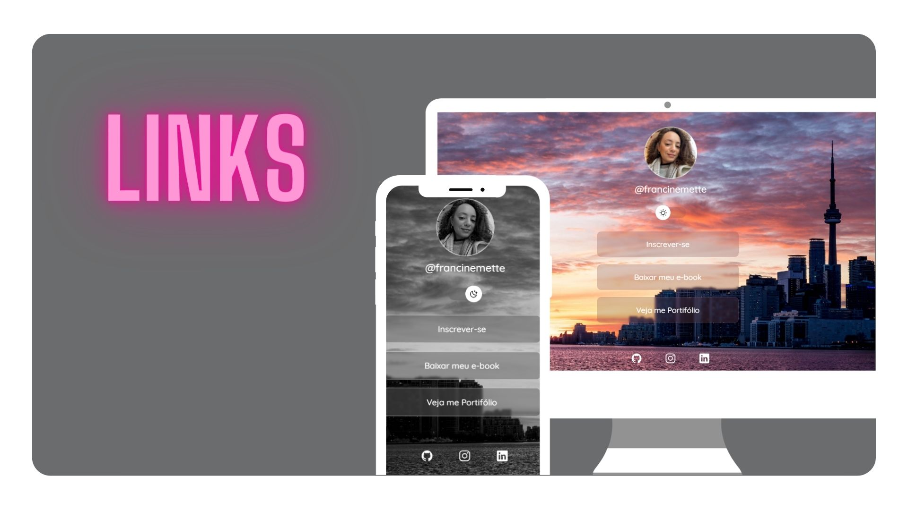

<h1 align="center"> Links </h1>

Exclusive and free program, promoted by Rocketseat for teaching WEB technologies.

  <a href="#-technologies">Technologies</a>&nbsp;&nbsp;&nbsp;|&nbsp;&nbsp;&nbsp;
  <a href="#-project">Projeto</a>&nbsp;&nbsp;&nbsp;|&nbsp;&nbsp;&nbsp;
  <a href="#memo-licença">Licença</a>
  

  

 

  

## 🚀 Technologies

This project was developed with the following technologies:

- HTML e CSS
- JavaScript
- Git e Github
- Figma

## 💻 Project

The "Links" Project is a link aggregator to use as an online business card.

## License

This project is licensed under the MIT license.

---

Made with ♥ by Francine Mette.
